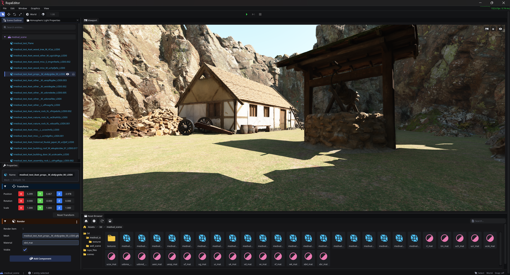

# Ruya Engine

> [!NOTE]
> **Showcase Repository:** This repository is a culmination of various components developed across my private repositories. While this public version highlights the core architecture, the development history and my journey with the Vulkan API extend much further back.



**Ruya** is a Vulkan-based game engine developed for personal projects and as a foundation for future research in computer graphics. Ruya Engine is under active development. 
Video demo: https://youtu.be/W4TspRLuAQw

## Features

* **PBR Rasterizer:** Physically Based Rendering pipeline for realistic material interaction.
* **Ray Traced Shadows:** Hardware-accelerated Ray Traced directional light shadows.
* **Ray Traced Diffuse Global Illumunation:** Hardware-accelerated Ray Traced diffuse GI.
* **Multi-Threaded Architecture:** Job system based architecture.
* **GLTF Integration:** Seamless model loading via the `tinygltf` library.
* **GameFramework:** ENTT based scripting framework for game logic.
* **Asset System:** Early-stage asset management (Note: Currently in experimental phase).
* **Editor:** Integrated UI based on **ImGUI** for real-time scene manipulation.

---

## System Requirements

To run Ruya, your hardware must meet the following specifications:

| Component | Minimum Requirement |
| --- | --- |
| **GPU** | NVIDIA RTX Series |
| **API** | Vulkan 1.3 or higher |
| **Platform** | Windows (x64) |

---

### Prerequisites

Before cloning, ensure you have **Git LFS** installed on your system, as the repository uses it for large files.

### Installation & Building

1. **Clone the Repository:**
```bash
git clone --recursive https://github.com/AlperenSahinn/ruya_alpha.git

```

2. **Run the Setup Script:**
Navigate to the `build_system` directory and run:
```batch
setup_windows.bat

```

This will generate the **Visual Studio 2026** solution.

3. **Build:**
Open the generated solution in VS2026 and build the project in `distribution` mode.

4. **Compiling shaders:**
Run the compile_shaders.bat file in `assets/ruya_files/shaders` to compile shaders.

### Running the Editor

Once the build is complete, you can find the executable at the following path:
`bin/windows-x86_64/Distribution/ruya_editor/`

### Loading the Test Scene

To test the renderer, you can load the included test scene:
1. Open the Asset Browser window and navigate to the scenes folder.
2. Double-click medieval_scene to load it.

---

> **Disclaimer:** The Asset System is in its infancy and may not behave as expected.
