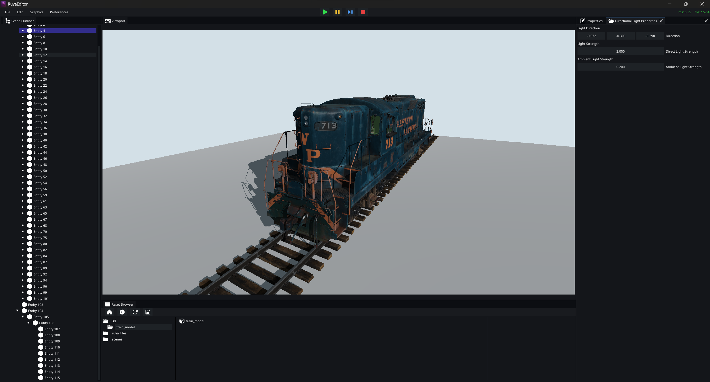
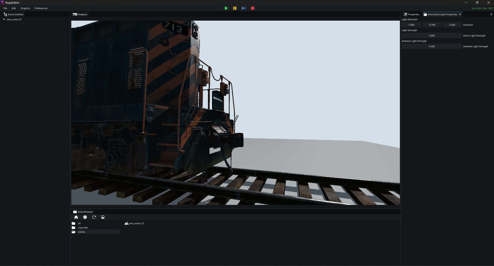

# Ruya Engine

> [!NOTE]
> **Showcase Repository:** This repository is a culmination of various components developed across my private repositories. While this public version highlights the core architecture, the development history and my journey with the Vulkan API extend much further back.



**Ruya** is a Vulkan-based game engine developed for personal projects and as a foundation for future research in computer graphics. While the engine is under active development, it provides a robust framework for modern rendering techniques.



## Features

* **PBR Rasterizer:** Physically Based Rendering pipeline for realistic material interaction.
* **Ray Traced Shadows:** Hardware-accelerated Ray Traced directional light shadows.
* **Multi-Threaded Architecture:** Decoupled **Main-Render thread** architecture.
* **Bindless Descriptors:** Bindless texture and material management.
* **Basic GPU-Driven Rendering:** Indirect drawing for basic GPU-driven rendering.
* **GLTF Integration:** Seamless model loading via the `tinygltf` library.
* **GameFramework:** ENTT based scripting framework for game logic.
* **Asset System:** Early-stage asset management (Note: Currently in experimental phase).
* **Editor:** Integrated UI based on **ImGUI** for real-time scene manipulation.

---

## System Requirements

To run Ruya, your hardware must meet the following specifications:

| Component | Minimum Requirement |
| --- | --- |
| **GPU** | NVIDIA RTX Series |
| **API** | Vulkan 1.3 or higher |
| **Platform** | Windows (x64) |

---

### Prerequisites

Before cloning, ensure you have **Git LFS** installed on your system, as the repository uses it for large files.

### Installation & Building

1. **Clone the Repository:**
```bash
git clone --recursive https://github.com/AlperenSahinn/ruya_alpha.git

```


2. **Run the Setup Script:**
Navigate to the `build_system` directory and run:
```batch
setup_windows.bat

```


This will generate the **Visual Studio 2026** solution.
3. **Build:**
Open the generated solution in VS2026 and build the project in either `debug` or `release` mode.

### Running the Editor

Once the build is complete, you can find the executable at the following path:
`bin/windows-x86_64/{debug|release}/ruya_editor/`

---

## Controls & Navigation

### Loading a Scene
1. Navigate to the `Scenes` folder in `Asset Browser`.
2. **Double-click** on the desired scene to load it into the hierarchy.

### Editor Camera Movement
| Action | Control |
| :--- | :--- |
| **Move Forward/Left/Back/Right** | `W` `A` `S` `D` |
| **Rotate Camera** | `Right Click` (Hold) + Mouse Move |

---

> **Disclaimer:** The Asset System is in its infancy and may not behave as expected.
